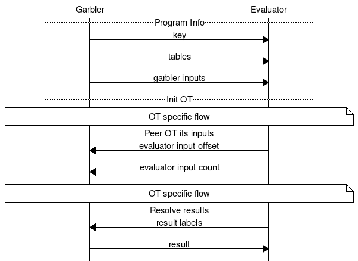

# Crypto Means Cryptography

Markku Rossi \
1 May 2023

## Agenda

- State of the union of cryptography
  - Symmetric encryption
  - Integrity protection
  - Public key cryptography
  - Key exchange
- What's new?
  - Multi-party computation
  - Homomorphic encryption
  - Zero-knowledge proof

## Symmetric encryption

```ascii-art,center
                  +-------+                          +-------+
Hello, world! --> |Encrypt| --> b4a5d01554f4032a --> |Decrypt| --> Hello, world!
                  +-------+     0dd74ce3667ed2e6     +-------+
```


| Algorithm        | NIST | PQC |
|:-----------------|:-----|:----|
| DES              | no   | no  |
| 2-key Triple DES | no   | no  |
| 3-key Triple DES | yes  | no  |
| Blowfish         | no   | no  |
| AES-128          | yes  | no  |
| AES-192          | yes  | no  |
| AES-256          | yes  | yes |
| Twofish-256      | no   | yes |


## Integrity protection


```plain
AES-128-Encrypt("100.00") => 31a2502247cf97e66537b93dcf88b5ea

31a 2502247c f97e66537b93dcf88b5ea
31a 35d1372e f97e66537b93dcf88b5ea

AES-128-Decrypt(31a35d1372ef97e66537b93dcf88b5ea) => "97476 4դC4??aJ"
```

## Integrity protection

| Algorithm | NIST | PQC |
|:----------|:-----|:----|
| MD5       | no   | no  |
| SHA-1     | yes  | no  |
| SHA-224   | yes  | no  |
| SHA-256   | yes  | yes |
| SHA-384   | yes  | yes |
| SHA-512   | yes  | yes |
| SHA3-224  | yes  | yes |
| SHA3-256  | yes  | yes |
| SHA3-384  | yes  | yes |
| SHA3-512  | yes  | yes |

## Public key cryptography

| Algorithm  | NIST | PQC |
|:-----------|:-----|:----|
| DSA        | no   | no  |
| RSA-1024   | no   | no  |
| RSA-2048   | yes  | no  |
| ECDSA      | yes  | no  |
| Ed25519    | no   | no  |
| Ed448      | no   | no  |
| Kyber      | yes* | yes |
| Dilithium2 | yes* | yes |
| FALCON     | yes* | yes |
| SPHINCS+   | yes* | yes |

## Yao's Millionaires' problem

```linenumbers
package main

func main(a, b int64) bool {
    if a > b {
        return true
    } else {
        return false
    }
}
```

## MPC Protocol



## Homomorphic Encryption


### AND Gate

```
Output = A * B
```

### OR Gate

```
Output = A + B - A * B
```

### Not Gate

```
Output = 1 - A
```

### XOR Gate

```
XOR(A, B) = (A AND (NOT B)) OR ((NOT A) AND B)
```

## Thank you

Markku Rossi \
<a href="mailto:mtr@iki.fi">mtr@iki.fi</a> \
<a href="https://twitter.com/markkurossi" target="_blank">@markkurossi</a> \
<a href="http://www.markkurossi.com" target="_blank">www.markkurossi.com</a>
